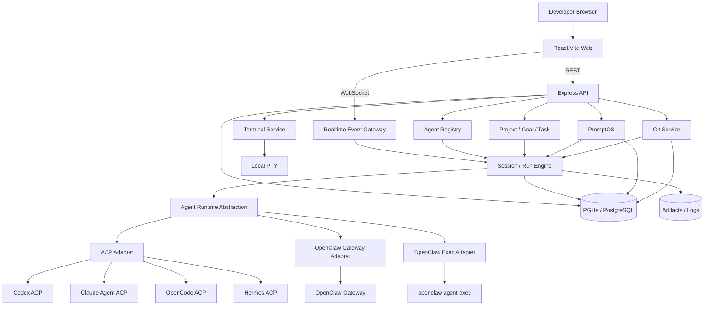
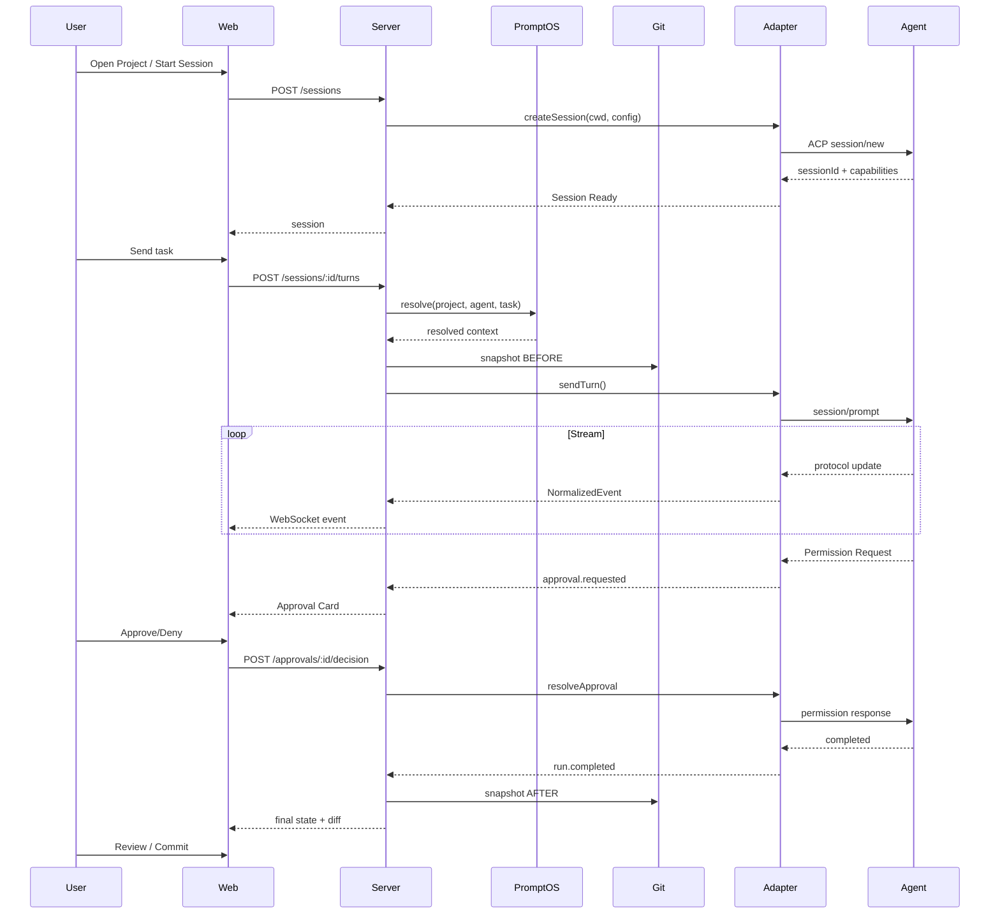

# AgentHub + PromptOS v0.1 MVP 技术方案

> 文档状态：Final Design / MVP Implementation Contract  
> 更新时间：2026-08-09  
> 目标读者：项目 Owner、Codex/Claude Code 等 Coding Agent、后续贡献者  
> 核心原则：**参考成熟开源产品与官方协议，不重新发明已经被验证的产品模式；MVP 做薄、做真、做闭环。**

---

# 0. 执行摘要

## 0.1 一句话定位

**AgentHub 是一个本地优先、自托管的 AI Software Engineering Control Plane（AI 软件工程控制平面）。**

它不替代 Codex、Claude Code、OpenCode、Hermes、OpenClaw，而是在它们之上提供统一的：

- Project / Goal / Task 管理；
- Agent 发现、接入、能力探测与会话管理；
- Coding Workspace（会话 + 文件 + Diff + Git + Terminal）；
- PromptOS（Prompt / Rule / Template / Skill 的版本、绑定、测试与发布）；
- Execution / Approval / Git delivery 的可追踪闭环；
- 后续可扩展到远程执行节点、多 Agent 编排、工作树自动任务、Memory、Eval、插件系统。

AgentHub 的产品目标不是“做一个聊天 Dashboard”，而是形成：

```text
需求 / Goal
    ↓
Task
    ↓
选择 Agent + PromptOS Context
    ↓
Agent Session / Run
    ↓
Tool / Approval / File Changes
    ↓
Git Diff / Review / Commit
    ↓
Done
```

## 0.2 最终推荐技术路线

### MVP 推荐

- **语言**：TypeScript-first
- **运行时**：Node.js 24 LTS
- **仓库**：pnpm workspace monorepo
- **后端**：Express 5 + TypeScript
- **前端**：React 19 + Vite + TypeScript
- **UI**：Tailwind CSS + shadcn/ui + Radix primitives
- **数据请求**：TanStack Query
- **数据库**：PGlite（默认本地嵌入式 PostgreSQL）+ Drizzle ORM
- **外部数据库**：通过 `DATABASE_URL` 切换标准 PostgreSQL
- **实时传输**：WebSocket
- **Agent 通用协议**：ACP v1（Agent Client Protocol）
- **ACP SDK**：官方 `@agentclientprotocol/sdk`
- **OpenClaw**：独立 Gateway Adapter + `openclaw agent exec` fallback
- **Git**：系统 `git` CLI
- **Terminal**：本地 PTY，按平台 capability 降级
- **测试**：Vitest + React Testing Library + Playwright
- **Spec**：OpenSpec
- **部署**：host-native server-first；Docker 不是本地 Agent MVP 默认形态

### MVP 明确不引入

- Spring Boot、Redis、Kafka/RabbitMQ、pgvector/独立向量库；
- 微服务、Kubernetes；
- 自研 Workflow DSL、自研 Agent 协议、自研 Prompt Eval 引擎；
- Agent Marketplace、多租户/RBAC；
- 自动下载安装第三方 Agent；
- 自动复制供应商凭据；
- 默认 YOLO / 全自动批准。

## 0.3 三个关键结论

### A. Agent 接入以 ACP 为通用层

ACP 已经覆盖 coding client ↔ coding agent 的本地/远程通信模式：本地 stdio JSON-RPC、远程 HTTP/WS、session、新建/加载/恢复/关闭、capability negotiation、permission、tool update、MCP、working directory 等。

因此：

```text
AgentHub Domain
      │
      ▼
Normalized Adapter API
      │
 ┌────┴───────────────────────┐
 ▼                            ▼
ACP Adapter              Native/Enhanced Adapter
 ├─ Claude Code           ├─ OpenClaw Gateway
 ├─ Codex                 ├─ Codex App Server（后续）
 ├─ OpenCode              ├─ Claude Agent SDK（后续）
 ├─ Hermes                └─ OpenCode Server/SDK（后续）
 └─ Custom ACP（后续）
```

### B. OpenClaw 不强行伪装成普通 CLI

OpenClaw 的 Gateway 本身就是 control plane；MVP 优先接 Gateway，单回合/无 Gateway 时走官方 `openclaw agent exec --json`。只有未来已安装版本明确暴露 ACP server 时才走通用 ACP。

### C. PromptOS 是 AgentHub 内部模块

PromptOS 不独立部署，负责 Prompt/Rule/Template/Skill 的版本、Label、Diff、Binding、Playground；输出必须进入 Project / Agent / Task / Session 的上下文闭环。

---

# 1. 调研与参考矩阵

资料优先级：

1. 官方协议；
2. 官方文档/官方 GitHub；
3. 高质量开源项目源码/架构；
4. issue/release notes 验证现实兼容性；
5. 不用二手博客承载关键决策。

| 参考项目  | 借鉴                                                                              | 不照搬                                          |
| --------- | --------------------------------------------------------------------------------- | ----------------------------------------------- |
| Codeg     | 多 Agent Workspace、ACP、会话/文件/Diff/Git/Terminal、Task Board、Agent Settings  | Rust/Tauri、完整高级 Git、多 Agent 委派、移动端 |
| Paperclip | Control Plane、Project/Goal/Task/Agent、Adapter、Node+React、Drizzle+PGlite       | AI Company/CEO/员工/heartbeat 语义              |
| Langfuse  | Prompt immutable version、label、production/latest、diff、side-by-side Playground | 全套 observability/ClickHouse                   |
| OpenHands | ACP delegation、远程 Agent Server/Workspace                                       | 自己的 Agent runtime/sandbox 全套               |
| ACP       | Agent 通用交互协议                                                                | 不把 ACP 类型泄漏进核心 Domain                  |
| OpenClaw  | Gateway control-plane、headless exec、远程 node 思路                              | 不复制渠道/调度系统                             |
| Promptfoo | Coding Agent eval/red team                                                        | MVP 不重写 eval 引擎                            |
| OpenSpec  | SDD 与可审阅变更                                                                  | 不为每个小 commit 建独立 spec                   |

组合关系：

```text
Paperclip → 控制平面：Project / Goal / Task / Agent / Activity
Codeg     → 执行工作台：Conversation / Files / Diff / Git / Terminal / Approval
Langfuse  → PromptOS：Prompt / Version / Label / Diff / Playground
ACP       → 通用 Agent I/O
OpenClaw  → 特殊 Gateway Runtime
```

---

# 2. Fork 路线取舍

## 2.1 直接 fork Codeg

优点：Workspace、ACP、五类 Agent、文件/Diff/Git/Terminal、Task/Worktree 都非常接近目标。  
问题：Rust + Tauri 核心；AgentHub 还要加入 Project/Goal/Task/PromptOS/Binding，领域侵入很大。

**结论：不 fork，把 Codeg 作为 Workspace/Agent UI 的视觉和交互基准。**

## 2.2 直接 fork Paperclip

优点：TypeScript、Node/React、Drizzle/PGlite、Adapter、Goal/Project/Issue。  
问题：产品核心是 AI company / employee / org，且 Coding Workspace 不是主线。

**结论：不 fork，借技术栈、Adapter 边界、Control Plane 原则、嵌入式 PG。**

## 2.3 新建薄 TypeScript Control Plane

优点：第一天就按 AgentHub 的 Project/Task/PromptOS 建模；直接吃 ACP TS 生态；技术栈接近 Paperclip。  
缺点：Workspace/Git 第一版要自己做。

**最终选择：C。新建代码，但不新造产品模式。**

---

# 3. 技术栈修订：为什么不是 Spring Boot MVP

传统 CRUD 并不是 AgentHub 最重部分。v0.1 主要复杂度在：

- ACP client、stdio 子进程、JSON-RPC；
- WebSocket/streaming；
- PTY；
- 本地 CLI；
- Agent SDK；
- capability；
- browser UI。

关键生态集中在 Node/TypeScript：ACP 官方 TS SDK、Claude Agent SDK TS、OpenCode JS/TS SDK、OpenClaw Gateway Node client；Paperclip 也以 Node/React + PGlite 证明控制平面形态。

若强行 Java：

```text
Spring Boot
  ├─ Node ACP sidecar
  ├─ Node Claude adapter
  ├─ Node OpenCode adapter
  └─ Node OpenClaw adapter
```

会增加双语言构建、IPC、类型同步、生命周期、日志与部署复杂度。

**v0.1 采用 TypeScript-first。**  
未来进入团队/企业、公司 Java 基建占主导时，再考虑拆 Java control-plane service。

---

# 4. 产品定义

## 4.1 MVP 用户

单个 Developer / Operator：

1. 选择本地仓库；
2. 看本机 Agent；
3. 在统一 UI 启动/继续会话；
4. 看工具调用、权限、文件变化；
5. 看 Git Diff；
6. 必要时 Terminal；
7. 管理 PromptOS 资产；
8. 将 Prompt/Rule/Skill 绑定 Project/Agent/Task；
9. 将需求推进到 Done。

## 4.2 Job To Be Done

- **统一 Agent**：不用重复开终端、找 cwd/历史。
- **工程闭环**：对话、文件、Diff、Git、Terminal 同屏。
- **Prompt 资产化**：提示词有 immutable version、Diff、Label、Binding。
- **任务追踪**：Goal → Task → Agent → Run → Git outcome。

## 4.3 非目标

v0.1 不是 IDE/VS Code/GitHub/CI/CD replacement，不是通用 BPM、多 Agent swarm、LLM Gateway、Prompt observability SaaS、Memory/RAG 平台。

---

# 5. 信息架构

一级导航：

```text
Dashboard
Projects
Tasks
Agents
Sessions
PromptOS
Settings
```

Project 内：

```text
Overview
Workspace
Tasks
PromptOS
Git
Settings
```

Dashboard 只回答：

1. 什么正在跑？
2. 什么需要我处理？
3. 最近完成什么？
4. 哪个 Agent/Project 出错？
5. 哪些 approval 在等我？

组件：

- Active Sessions
- Needs Attention
- Running Tasks
- Recent Activity
- Agent Health
- Recent Git Outcomes

不做 KPI 卡片墙/无意义 Token 饼图。

---

# 6. Workspace UI/UX

视觉与交互主参考：**Codeg Workspace**。

```text
┌───────────────┬────────────────────────┬──────────────────┬────────────────┐
│ Conversations │ Conversation           │ Files / Diff     │ Changes / Git  │
│ project group │ messages/tool cards    │ editor/preview   │ Session Info   │
│ status        │ approvals              │ live diff        │ Approvals      │
│               │ composer               │                  │ Artifacts      │
│               ├────────────────────────┴──────────────────┴────────────────┤
│               │ Terminal (collapsible / resizable)                         │
└───────────────┴──────────────────────────────────────────────────────────────┘
```

必须：

- 分栏 resize；
- Conversation 与 File/Diff 同屏；
- Terminal 可折叠；
- Project/cwd/branch 始终可见；
- Agent/model/mode 在 composer 可见（仅 capability 有才显示）；
- Run/connection status；
- approval 卡片贴近 composer；
- Stop/Cancel 固定可达；
- Tool call 结构化，不默认 raw JSON；
- Debug View 才展示 raw event。

Composer 借 Codeg：

```text
Agent | Model | Mode | Project/cwd | Branch | PromptOS bindings | Skills | Attachments | Send/Stop
```

权限原则：**展示并回传 Agent 原生 permission options，不造统一永久 auto-approve。**

Tool card 状态：

```text
queued / running / success / failed / cancelled / waiting_approval
```

只展示协议明确给用户的 plan/status；禁止收集/要求隐藏 chain-of-thought。

响应式：

- 大屏多栏；
- 中屏 Files/Git 转 tabs；
- 小屏 Conversation 主视图 + drawer/tabs；
- 不把四栏硬压成四条。

---

# 7. Task Board

借 Codeg 的核心语义：conversation 是交互，task 是“写下后交给 Agent 做、回来 review”。

MVP 状态：

```text
BACKLOG → READY → RUNNING → REVIEW → DONE
                     ↘ BLOCKED
任何阶段可 → CANCELED
```

“Start with Agent”：

1. Task 选择 Agent；
2. 创建/选择 Session；
3. 解析 PromptOS Context；
4. 发起 Run；
5. Task → RUNNING；
6. Run 完成 → REVIEW；失败 → BLOCKED；
7. 用户 review → DONE。

v0.1 不自动 worktree。v0.2 再借 Codeg 做：

```text
TODO → QUEUED → SETTING_UP → RUNNING ↔ AWAITING_INPUT → REVIEW → MERGING → DONE
```

且 review gate 后才 merge。

---

# 8. Agent Runtime 架构

核心接口不依赖 ACP 类型：

```ts
export interface AgentRuntimeAdapter {
  readonly kind: string;
  preflight(profile: AgentProfile): Promise<PreflightReport>;
  getCapabilities(profile: AgentProfile): Promise<AgentCapabilities>;
  discoverModels?(profile: AgentProfile): Promise<ModelOption[]>;
  createSession(input: CreateAgentSessionInput): Promise<AgentSessionHandle>;
  loadSession?(input: LoadAgentSessionInput): Promise<AgentSessionHandle>;
  resumeSession?(input: ResumeAgentSessionInput): Promise<AgentSessionHandle>;
}

export interface AgentSessionHandle {
  readonly externalSessionId?: string;
  events(): AsyncIterable<NormalizedAgentEvent>;
  sendTurn(input: AgentTurnInput): Promise<AgentRunRef>;
  resolveApproval(id: string, decision: ApprovalDecision): Promise<void>;
  cancel(runId?: string): Promise<void>;
  close(): Promise<void>;
}
```

Capability：

```ts
export interface AgentCapabilities {
  sessions: { create: boolean; load: boolean; resume: boolean; close: boolean };
  prompts: { text: boolean; images: boolean; resources: boolean };
  interaction: { streaming: boolean; approvals: boolean; questions: boolean; plan: boolean };
  workspace: {
    files: boolean;
    terminal: boolean;
    additionalRoots: boolean;
    mcpStdio: boolean;
    mcpHttp: boolean;
  };
  configuration: { models: boolean; modes: boolean; reasoningEffort: boolean };
  telemetry: { tokenUsage: boolean; cost: boolean };
}
```

UI 必须 capability-driven，不写 provider name-based feature switch。

ACP v2 仍为 draft，所以：

```text
packages/adapter-acp (ACP types)
        ↓ normalize
packages/agent-core (AgentHub types)
```

---

# 9. 五类 Agent 接入

## 9.1 Codex

推荐：

```text
AgentHub → AcpAdapter → pinned codex-acp → Codex App Server → Codex
```

`codex-acp` 已负责将 Codex App Server operation/event 映射为 ACP，覆盖 permission、terminal、file change、plan、usage、MCP 等。

Preflight 不是只看 binary：

- adapter 可启动；
- Codex version；
- ACP initialize；
- auth method；
- session/new；
- capabilities。

认证优先复用用户现有 Codex 认证；**不把 auth/refresh token 复制到 AgentHub DB**。

未来若 ACP 丢失关键 Codex 特有能力，再增加 direct Codex App Server enhanced adapter；v0.1 不同时维护两套。

## 9.2 Claude Code

推荐：

```text
AgentHub → AcpAdapter → claude-agent-acp → Claude Agent SDK
```

Claude Agent SDK 与 Claude Code 使用相同 agent loop/tool/context 能力。不要自己用 Messages API 重做 Claude Code。

`CLAUDE.md` 等 native instructions 由 Claude runtime 自己处理；PromptOS 是额外编排上下文，不能静默覆盖。

## 9.3 OpenCode

官方原生：

```text
opencode acp
```

MVP 直接通用 ACP。`opencode serve` + `@opencode-ai/sdk` 作为后续 enhanced adapter，不在 v0.1 双实现。

## 9.4 Hermes

官方：

```bash
hermes acp
hermes-acp
python -m acp_adapter
```

可用时 preflight：

```bash
hermes acp --version
hermes acp --check
```

Hermes ACP 能暴露 file/terminal/web/memory/todo/skills/delegation/vision 等；AgentHub 不硬编码其内部 tool 名称，完全按 capability/event 处理。

## 9.5 OpenClaw

优先 Path A：

```text
AgentHub → OpenClawGatewayAdapter → @openclaw/gateway-client → Existing Gateway
```

配置只存 Gateway URL + token secret reference，不存 token 明文。

Fallback Path B：

```bash
openclaw agent exec --message-file ... --cwd ... --json
```

用于 headless/单回合。

禁止：

- 已有 Gateway 时悄悄再起一个；
- 默认把 OpenClaw 当 ACP server；
- 修改 OpenClaw state dir；
- 在其 active state dir 做 coding task。

## 9.6 接入矩阵

| Agent       | MVP Transport            |   Session | Streaming |   Approval | 推荐     |
| ----------- | ------------------------ | --------: | --------: | ---------: | -------- |
| Codex       | ACP via codex-acp        |        是 |        是 |         是 | P0       |
| Claude Code | ACP via claude-agent-acp |        是 |        是 |         是 | P0       |
| OpenCode    | native ACP               |        是 |        是 | capability | P0       |
| Hermes      | native ACP               |        是 |        是 |         是 | P0       |
| OpenClaw    | Gateway WS               |        是 |        是 | capability | P0       |
| OpenClaw    | agent exec JSON          | 弱/单回合 |    按实现 |         弱 | fallback |

“支持 Agent”的验收必须包含：preflight、capability、session、turn、stream、error、cancel/unsupported、approval/unsupported、cwd、file/Git visible、重启历史、missing/auth 状态真实。

---

# 10. Process Supervisor

职责：

- spawn/stdio/stderr；
- process group；
- timeout；
- graceful cancel + kill tree；
- backpressure；
- exit code/crash；
- max output；
- redaction；
- env construction。

禁止：

```ts
exec(`${command} ${userInput}`);
```

必须：

```ts
spawn(binary, args, { shell: false, cwd, env });
```

binary 来自预检后的 absolute path 或 AgentHub 自身锁定的 executable。

Cancel：

1. protocol cancel；
2. graceful；
3. SIGTERM process group；
4. SIGKILL；
5. Run=CANCELED；
6. 持久化最后状态。

interactive session 崩溃不盲目 auto-restart，避免重复 shell/文件写/commit；若支持 resume 才显式恢复。

---

# 11. Normalized Event

```ts
export interface NormalizedAgentEvent<T = unknown> {
  eventId: string;
  sessionId: string;
  runId?: string;
  seq: number;
  emittedAt: string;
  adapterKind: string;
  type: AgentEventType;
  payload: T;
  source?: { protocol?: string; eventType?: string };
}
```

MVP event：

```text
session.created / state_changed / closed
run.started / completed / failed / cancelled
assistant.message.delta / completed
agent.plan.updated / agent.status
tool.call.started / progress / completed / failed
approval.requested / resolved
file.changed / git.status.changed
usage.updated / artifact.created
adapter.warning / adapter.disconnected
```

高频 token delta 只直播/合并；最终 message 与 semantic event 落库。每 session `seq` 单调递增，重连可 `afterSeq` 补事件。

---

# 12. PromptOS

借鉴 Langfuse：

```text
Prompt
 ├─ Version 1 immutable
 ├─ Version 2 immutable ← latest
 └─ Version 3 immutable ← production
```

Label 是可移动指针；旧 version 永不覆盖。

Kind：

```text
SYSTEM / TASK / REVIEW / COMMIT / RULE / TEMPLATE
```

Type：

```text
TEXT / CHAT
```

变量必须有 schema；缺 required 时不发起 Agent。

Binding：

```text
Project → TASK_PRIMER → feature-implementation@production
Codex   → REVIEW      → codex-review@v7
Task    → RULES       → migration-constraints@v2
```

Selector：

```text
LABEL / VERSION
```

解析优先级：

```text
Project → Agent → Task
```

同 slot 用 priority；发 Run 前提供 **Context Preview**，清楚显示最终注入内容与来源。

Playground 分：

1. **Render Playground（P0）**：变量、版本、side-by-side、Diff，不调用 Agent；
2. **Agent Test（后续/capability guarded）**：coding agent 会改仓库，只有安全/只读/plan 或 scratch worktree 时允许。

Skills MVP 只扫描/import metadata/bind，不做 Marketplace，不重定义 Skill 标准。

Memory：**v0.1 不实现。** 先解决 provenance/scope/TTL/edit/delete/retrieval trace 后再决定 vector 技术。

---

# 13. 数据库总体设计

默认：

```text
~/.agenthub/data/pgdata
```

使用 PGlite；若：

```bash
DATABASE_URL=postgres://...
```

则切标准 PostgreSQL，同一套 Drizzle schema/migrations。

原则：

- UUID 由 app `crypto.randomUUID()` 生成；
- 时间 `timestamptz`，DB 存 UTC；
- JSONB 只承载 capability/config/event metadata，不把核心可查询字段全部塞 JSON；
- 大 patch/日志放 artifact filesystem，DB 存索引和摘要。

---

# 14. 数据库表设计

## 14.1 `app_settings`

| 字段       | 类型        | 说明         |
| ---------- | ----------- | ------------ |
| key        | text PK     | 设置 key     |
| value_json | jsonb       | 非 secret 值 |
| updated_at | timestamptz | 更新时间     |

Secrets 不放这里。

## 14.2 `api_tokens`

用于非 localhost token mode：

| 字段         | 类型             |
| ------------ | ---------------- |
| id           | uuid PK          |
| name         | text             |
| token_hash   | text             |
| created_at   | timestamptz      |
| last_used_at | timestamptz null |
| revoked_at   | timestamptz null |

只存 hash；明文只在创建时返回一次。

## 14.3 `execution_targets`

MVP 只有 `LOCAL`，但预留远程 Node。

| 字段              | 类型                     |
| ----------------- | ------------------------ |
| id                | uuid PK                  |
| name              | text                     |
| kind              | text `LOCAL/REMOTE_NODE` |
| hostname          | text                     |
| os                | text                     |
| arch              | text                     |
| status            | text                     |
| capabilities_json | jsonb                    |
| connection_json   | jsonb                    |
| last_seen_at      | timestamptz null         |
| created_at        | timestamptz              |
| updated_at        | timestamptz              |

这样 v0.2 remote node 不需重构 Agent 表。

## 14.4 `projects`

| 字段             | 类型             |
| ---------------- | ---------------- |
| id               | uuid PK          |
| name             | text             |
| description      | text null        |
| target_id        | uuid FK          |
| root_path        | text             |
| real_root_path   | text             |
| repo_kind        | text             |
| default_agent_id | uuid null        |
| status           | text             |
| created_at       | timestamptz      |
| updated_at       | timestamptz      |
| archived_at      | timestamptz null |

约束：`(target_id, real_root_path)` unique；archive 不物理删历史。

## 14.5 `agents`

代表已配置的 Agent Profile：

| 字段              | 类型             |
| ----------------- | ---------------- |
| id                | uuid PK          |
| target_id         | uuid FK          |
| name              | text             |
| agent_kind        | text             |
| adapter_kind      | text             |
| executable        | text null        |
| args_json         | jsonb            |
| env_refs_json     | jsonb            |
| config_json       | jsonb            |
| default_model     | text null        |
| default_mode      | text null        |
| capabilities_json | jsonb            |
| detected_version  | text null        |
| status            | text             |
| enabled           | boolean          |
| last_preflight_at | timestamptz null |
| created_at        | timestamptz      |
| updated_at        | timestamptz      |

`agent_kind`：

```text
CODEX / CLAUDE_CODE / OPENCODE / HERMES / OPENCLAW / CUSTOM_ACP
```

`adapter_kind`：

```text
ACP_STDIO / OPENCLAW_GATEWAY / OPENCLAW_EXEC
```

未来可扩：

```text
CODEX_APP_SERVER / CLAUDE_SDK / OPENCODE_SERVER / REMOTE_NODE_ACP
```

## 14.6 `agent_sessions`

| 字段                | 类型             |
| ------------------- | ---------------- |
| id                  | uuid PK          |
| project_id          | uuid FK          |
| agent_id            | uuid FK          |
| task_id             | uuid null        |
| external_session_id | text null        |
| title               | text             |
| cwd                 | text             |
| branch              | text null        |
| status              | text             |
| model               | text null        |
| mode                | text null        |
| last_seq            | bigint           |
| created_at          | timestamptz      |
| started_at          | timestamptz null |
| last_active_at      | timestamptz      |
| closed_at           | timestamptz null |
| archived_at         | timestamptz null |

状态：

```text
CREATED / STARTING / READY / RUNNING / WAITING_APPROVAL /
DISCONNECTED / FAILED / CLOSED
```

## 14.7 `agent_runs`

每轮用户请求一个 Run：

| 字段             | 类型             |
| ---------------- | ---------------- |
| id               | uuid PK          |
| session_id       | uuid FK          |
| task_id          | uuid null        |
| parent_run_id    | uuid null        |
| input_message_id | uuid null        |
| external_run_id  | text null        |
| status           | text             |
| model            | text null        |
| mode             | text null        |
| started_at       | timestamptz      |
| finished_at      | timestamptz null |
| exit_code        | int null         |
| input_tokens     | bigint null      |
| output_tokens    | bigint null      |
| cost_amount      | numeric null     |
| cost_currency    | text null        |
| git_before_sha   | text null        |
| git_after_sha    | text null        |
| error_code       | text null        |
| error_message    | text null        |
| metadata_json    | jsonb            |

usage/cost 可空，不能因为某 Agent 不提供就伪造 0。

## 14.8 `messages`

只存用户可显示/审计消息：

| 字段         | 类型        |
| ------------ | ----------- |
| id           | uuid PK     |
| session_id   | uuid FK     |
| run_id       | uuid null   |
| role         | text        |
| kind         | text        |
| text         | text null   |
| content_json | jsonb       |
| sequence     | bigint      |
| created_at   | timestamptz |

role：

```text
USER / ASSISTANT / SYSTEM / TOOL
```

不要求存 provider 隐藏 reasoning。

## 14.9 `run_events`

| 字段               | 类型        |
| ------------------ | ----------- |
| id                 | uuid PK     |
| session_id         | uuid FK     |
| run_id             | uuid null   |
| seq                | bigint      |
| type               | text        |
| payload_json       | jsonb       |
| adapter_event_type | text null   |
| created_at         | timestamptz |

约束：`UNIQUE(session_id, seq)`。

索引：

```text
(session_id, seq)
(run_id, created_at)
(type, created_at)
```

## 14.10 `approval_requests`

| 字段          | 类型             |
| ------------- | ---------------- |
| id            | uuid PK          |
| session_id    | uuid FK          |
| run_id        | uuid FK          |
| external_id   | text             |
| kind          | text             |
| status        | text             |
| title         | text             |
| description   | text null        |
| options_json  | jsonb            |
| request_json  | jsonb            |
| response_json | jsonb null       |
| requested_at  | timestamptz      |
| resolved_at   | timestamptz null |

同一 approval exactly-once resolve；重复请求返回已解决状态，不重复调用 Agent。

## 14.11 `artifacts`

| 字段          | 类型        |
| ------------- | ----------- |
| id            | uuid PK     |
| run_id        | uuid FK     |
| message_id    | uuid null   |
| type          | text        |
| path          | text        |
| display_name  | text        |
| mime_type     | text null   |
| size_bytes    | bigint null |
| sha256        | text null   |
| metadata_json | jsonb       |
| created_at    | timestamptz |

## 14.12 `goals`

| 字段             | 类型        |
| ---------------- | ----------- |
| id               | uuid PK     |
| project_id       | uuid FK     |
| parent_id        | uuid null   |
| title            | text        |
| description      | text null   |
| success_criteria | text null   |
| status           | text        |
| created_at       | timestamptz |
| updated_at       | timestamptz |

状态：`DRAFT / ACTIVE / ACHIEVED / CANCELED`。

## 14.13 `tasks`

| 字段                | 类型             |
| ------------------- | ---------------- |
| id                  | uuid PK          |
| project_id          | uuid FK          |
| goal_id             | uuid null        |
| parent_id           | uuid null        |
| title               | text             |
| description         | text null        |
| acceptance_criteria | text null        |
| status              | text             |
| priority            | int              |
| assigned_agent_id   | uuid null        |
| session_id          | uuid null        |
| final_run_id        | uuid null        |
| branch              | text null        |
| position            | numeric          |
| created_at          | timestamptz      |
| updated_at          | timestamptz      |
| completed_at        | timestamptz null |

索引：

```text
(project_id, status, position)
(goal_id, status)
(assigned_agent_id, status)
```

## 14.14 `prompts`

Stable identity：

| 字段        | 类型             |
| ----------- | ---------------- |
| id          | uuid PK          |
| project_id  | uuid null        |
| key         | text             |
| name        | text             |
| description | text null        |
| kind        | text             |
| type        | text             |
| created_at  | timestamptz      |
| updated_at  | timestamptz      |
| archived_at | timestamptz null |

`(project_id, key)` unique；global scope 用 partial/application constraint。

## 14.15 `prompt_versions`

**immutable**：

| 字段           | 类型        |
| -------------- | ----------- |
| id             | uuid PK     |
| prompt_id      | uuid FK     |
| version        | int         |
| content_json   | jsonb       |
| variables_json | jsonb       |
| config_json    | jsonb       |
| changelog      | text null   |
| source         | text        |
| content_hash   | text        |
| created_by     | text        |
| created_at     | timestamptz |

约束 `UNIQUE(prompt_id, version)`；**没有 updated_at，禁止更新内容。**

## 14.16 `prompt_labels`

| 字段       | 类型        |
| ---------- | ----------- |
| prompt_id  | uuid FK     |
| label      | text        |
| version_id | uuid FK     |
| updated_at | timestamptz |

PK `(prompt_id, label)`。

系统自动维护 `latest`；用户可移动 `production/staging/custom`。

## 14.17 `prompt_bindings`

| 字段          | 类型        |
| ------------- | ----------- |
| id            | uuid PK     |
| target_type   | text        |
| target_id     | uuid        |
| slot          | text        |
| prompt_id     | uuid FK     |
| selector_type | text        |
| label         | text null   |
| version_id    | uuid null   |
| priority      | int         |
| enabled       | boolean     |
| created_at    | timestamptz |
| updated_at    | timestamptz |

target：`PROJECT / AGENT / TASK`。  
slot：`SYSTEM / TASK_PRIMER / REVIEW / COMMIT / RULES`。  
selector：`LABEL / VERSION`。

## 14.18 `skills`

| 字段          | 类型        |
| ------------- | ----------- |
| id            | uuid PK     |
| project_id    | uuid null   |
| slug          | text        |
| name          | text        |
| description   | text null   |
| source        | text        |
| root_path     | text        |
| manifest_json | jsonb       |
| content_hash  | text        |
| enabled       | boolean     |
| created_at    | timestamptz |
| updated_at    | timestamptz |

## 14.19 `skill_bindings`

| 字段        | 类型        |
| ----------- | ----------- |
| id          | uuid PK     |
| skill_id    | uuid FK     |
| target_type | text        |
| target_id   | uuid        |
| enabled     | boolean     |
| created_at  | timestamptz |

## 14.20 `git_snapshots`

| 字段            | 类型        |
| --------------- | ----------- |
| id              | uuid PK     |
| run_id          | uuid FK     |
| project_id      | uuid FK     |
| snapshot_type   | text        |
| head_sha        | text null   |
| branch          | text null   |
| status_json     | jsonb       |
| diff_stat_json  | jsonb       |
| patch_file_path | text null   |
| created_at      | timestamptz |

类型：`BEFORE / AFTER / REVIEW`。巨大 patch 放 `~/.agenthub/artifacts/<runId>/`。

---

# 15. 数据一致性规则

1. `prompt_versions` 不 update；
2. label move transaction；
3. Run completion 与 AFTER git snapshot 顺序固定；
4. approval 仅 PENDING → terminal state 一次；
5. task 状态机校验，禁止 DONE → RUNNING；
6. session seq 单调递增；
7. project archive 不删历史；
8. Agent 有历史引用时 disable/archive，不硬删除；
9. artifact path 必须在 AgentHub artifact root；
10. run event payload 先 secret redaction。

---

# 16. API 设计

Base：`/api/v1`

错误：

```json
{
  "error": {
    "code": "AGENT_PREFLIGHT_FAILED",
    "message": "Codex ACP adapter could not start",
    "details": {},
    "requestId": "req_xxx"
  }
}
```

## 16.1 System/Auth

| Method | Endpoint           | 说明                |
| ------ | ------------------ | ------------------- |
| GET    | `/health`          | liveness            |
| GET    | `/bootstrap`       | version/server mode |
| GET    | `/settings`        | 设置                |
| PATCH  | `/settings`        | 修改非 secret 设置  |
| GET    | `/auth/tokens`     | token metadata      |
| POST   | `/auth/tokens`     | 创建 token          |
| DELETE | `/auth/tokens/:id` | revoke              |

## 16.2 Projects

| Method    | Endpoint                  |
| --------- | ------------------------- |
| GET/POST  | `/projects`               |
| GET/PATCH | `/projects/:id`           |
| POST      | `/projects/:id/archive`   |
| POST      | `/projects/:id/preflight` |

Project preflight：path exists/canonical/git/branch/dirty/write permission/AGENTS.md/CLAUDE.md/OpenSpec/package manager hints。

## 16.3 Agents

| Method    | Endpoint                   |
| --------- | -------------------------- |
| POST      | `/agent-discovery/scan`    |
| GET       | `/agent-types`             |
| GET/POST  | `/agents`                  |
| GET/PATCH | `/agents/:id`              |
| POST      | `/agents/:id/preflight`    |
| GET       | `/agents/:id/capabilities` |
| GET       | `/agents/:id/models`       |
| POST      | `/agents/:id/disable`      |

Discovery 是只读，不自动 install。

返回示例：

```json
{
  "kind": "CODEX",
  "status": "FOUND",
  "executable": "/path/to/codex",
  "version": "x.y.z",
  "adapter": { "kind": "ACP_STDIO", "status": "READY" }
}
```

## 16.4 Sessions/Runs

| Method   | Endpoint               |
| -------- | ---------------------- |
| GET/POST | `/sessions`            |
| GET      | `/sessions/:id`        |
| POST     | `/sessions/:id/turns`  |
| POST     | `/sessions/:id/resume` |
| POST     | `/sessions/:id/close`  |
| GET      | `/sessions/:id/events` |
| POST     | `/runs/:id/cancel`     |

Turn：

```json
{
  "clientRequestId": "uuid",
  "message": { "text": "Implement the API" },
  "model": null,
  "mode": null,
  "promptContext": { "useBindings": true }
}
```

`clientRequestId` 提供幂等重试。

## 16.5 Approval

| Method | Endpoint                    |
| ------ | --------------------------- |
| GET    | `/approvals?status=PENDING` |
| GET    | `/approvals/:id`            |
| POST   | `/approvals/:id/decision`   |

decision 只能提交 Agent 原始 option id，不能自己造 `allowAlways`。

---

# 17. PromptOS API

Prompt：

```text
GET/POST /prompts
GET/PATCH /prompts/:id
POST /prompts/:id/archive
```

PATCH 只改 metadata，不改版本内容。

Version：

```text
GET  /prompts/:id/versions
POST /prompts/:id/versions
GET  /prompts/:id/versions/:version
GET  /prompts/:id/diff?from=3&to=5
```

Label：

```text
GET    /prompts/:id/labels
PUT    /prompts/:id/labels/:label
DELETE /prompts/:id/labels/:label
```

`latest` 不允许手工删/移。

Render：

```text
POST /prompts/:id/render
```

返回 resolved version/content/missing vars/hash。

Bindings：

```text
GET/POST /prompt-bindings
PATCH/DELETE /prompt-bindings/:id
POST /prompt-context/resolve
```

`resolve(project, agent, task)` 必须返回最终 PromptOS context 与每项 provenance，这是调试和可复现的核心。

---

# 18. Git / Terminal / WebSocket

Git MVP：

```text
GET /projects/:id/git/status
GET /projects/:id/git/diff
GET /projects/:id/git/commits
GET /projects/:id/git/branches
POST /projects/:id/git/commit
```

不做 v0.1：rebase/stash/merge editor/force push/reset --hard UI。

Commit 必须明确 staged/selected files，禁止默认 `git add -A`。

Terminal：

- 用户 PTY 与 Agent shell/tool execution 分开；
- 支持 cwd/input/output/resize/close；
- 平台不支持时 capability false，不阻塞 core。

WebSocket 单端点：

```text
/ws
```

subscribe：

```json
{
  "type": "subscribe",
  "topics": ["session:sess_123", "project:proj_123", "approvals"],
  "afterSeq": { "sess_123": 882 }
}
```

Server event：

```json
{
  "type": "event",
  "topic": "session:sess_123",
  "event": { "seq": 883, "type": "tool.call.started", "payload": {} }
}
```

---

# 19. 后端模块

```text
apps/server/src/
  app/
  http/
  ws/
  modules/
    auth/
    settings/
    targets/
    projects/
    agents/
    sessions/
    runs/
    approvals/
    promptos/
    skills/
    tasks/
    git/
    terminal/
    artifacts/
  infrastructure/
    db/
    fs/
    process/
    logging/
    secrets/
```

边界：

- Projects：project/path/context discovery；
- Agents：registry/discovery/profile/adapter/capability/preflight；
- Sessions/Runs：session lifecycle/turn/events/cancel/reconnect；
- Approvals：pending/exactly-once/notification；
- PromptOS：prompt/version/label/diff/binding/render；
- Git：status/diff/snapshot/commit；
- Terminal：user PTY。

---

# 20. Monorepo / Frontend

```text
agenthub/
├─ apps/
│  ├─ server/
│  ├─ web/
│  └─ cli/
├─ packages/
│  ├─ shared/
│  ├─ db/
│  ├─ agent-core/
│  ├─ adapter-acp/
│  ├─ adapter-openclaw/
│  └─ ui/
├─ tests/
│  ├─ fixtures/
│  └─ e2e/
├─ docs/
│  ├─ GOAL.md
│  ├─ PRODUCT.md
│  ├─ SPEC-MVP.md
│  ├─ DATABASE.md
│  ├─ API.md
│  ├─ SECURITY.md
│  ├─ UI-REFERENCE.md
│  ├─ AGENT-INTEGRATION.md
│  ├─ ADR/
│  └─ implementation/
├─ openspec/
├─ AGENTS.md
├─ package.json
└─ pnpm-workspace.yaml
```

不要每个 domain 拆 package；稳定边界才 package。

Frontend：

```text
apps/web/src/
  app/
  routes/
  features/
    dashboard/
    projects/
    workspace/
    tasks/
    agents/
    sessions/
    promptos/
    git/
    settings/
  components/
  hooks/
  api/
  stores/
  styles/
```

Server state → TanStack Query；ephemeral UI state → local/store。一个统一 WS client，禁止每组件自己连 WS。

---

# 21. UI Reference Contract

Codex 实现时必须打开当前真实参考资料，建立：

```text
docs/design/reference-audit.md
```

每项写：

```text
Reference
Borrowed pattern
AgentHub mapping
Intentionally omitted
```

映射：

- Workspace / Agent settings / Task → Codeg；
- Dashboard/control plane → Paperclip；
- Prompt versions/labels/diff/playground → Langfuse；
- component primitives → shadcn/ui/Radix。

不复制 logo/品牌资产/不兼容源码。

Agent Center 推荐左侧 list + 右侧 detail：status/version/executable/adapter/capability/model/mode/preflight/config；不要 Agent logo 卡片墙。

---

# 22. Onboarding

目标：供应商自身登录时间之外，首次闭环尽量短。

1. Add Project：path/git/branch/dirty/AGENTS.md/CLAUDE.md/OpenSpec；
2. Discover Agents；
3. 状态真实显示：
   - READY
   - AUTH_REQUIRED
   - BROKEN
   - MISSING
   - UNSUPPORTED_VERSION
4. 选择 Default Agent；
5. Start First Session。

需要登录时给原生命令，用户在 integrated terminal 或自己的 terminal 完成；AgentHub 不造供应商登录表单。

---

# 23. 安全模型

## 23.1 Server 模式

默认：

```text
local_trusted
bind 127.0.0.1
```

若 bind 非 loopback/LAN/Tailscale：

必须 token auth。`host != loopback && auth disabled` 默认拒绝启动，除非显式 insecure dev flag。

## 23.2 Secrets

禁止 DB 明文保存：

- OpenAI/Anthropic API key；
- Gateway token；
- refresh token；
- cookies。

MVP 只存引用：

```json
{ "tokenRef": { "kind": "ENV", "name": "OPENCLAW_GATEWAY_TOKEN" } }
```

## 23.3 Filesystem

Project 必须 `realpath()`；所有文件 API resolve 后确认仍在 allow root；防 `../`、absolute escape、symlink escape。additional root 必须显式 allowlist。

## 23.4 Native Permission First

AgentHub 展示/转发/审计原生权限，不成为统一 YOLO sandbox。

## 23.5 Log Redaction

至少遮蔽 `*_API_KEY`、`*_TOKEN`、Authorization、Cookie、known auth file content、bearer/gateway token。

## 23.6 Supply Chain

v0.1 不自动从 registry 安装 Agent。未来 Custom ACP 才引入 distribution manifest、platform filter、version pin、SHA-256、preflight、explicit confirmation。

---

# 24. 部署与远程扩展

## 24.1 MVP Same-host

```text
Browser
  ↓
AgentHub Server
  ├─ codex
  ├─ claude
  ├─ opencode
  ├─ hermes
  └─ openclaw
```

最符合本地 CLI/auth/repo/PTY。

## 24.2 Docker 非默认

AgentHub 在容器、Agent 在 host 时，不能天然复用 host CLI/keychain/HOME/PTY/repos/Git SSH。强行 mount HOME/SSH/auth/docker socket 会扩大风险。

Docker 只作为：

> AgentHub + Agents 都在同一受控容器环境

的后续部署方式。

## 24.3 v0.2 Remote Node

借 OpenHands Agent Server/OpenClaw node 思路：

```text
Central AgentHub
      │ TLS WS
      ▼
AgentHub Node
      ├─ local Agent CLIs
      ├─ local repos
      └─ local credentials
```

原则：

- Node outbound；
- one-time registration；
- device identity；
- per-target roots；
- report agent inventory/capabilities；
- secret 留 Node；
- central 不复制 provider credential。

---

# 25. Git 设计

Conventional Commits，**subject 中文**：

```text
feat(adapter-acp): 接入 ACP 会话与事件归一化

- 增加 stdio 生命周期管理
- 支持 session/new 与 capability negotiation
- 增加 fixture 测试
```

原则：一个可验证 slice 一个 commit；不混无关 refactor；不提交 `.env`、auth、state、db、logs。

推荐序列：

1. `chore(repo): 初始化 pnpm monorepo 与工程质量门禁`
2. `docs(spec): 建立 GOAL、PRODUCT、MVP 与 OpenSpec 基线`
3. `feat(db): 建立 PGlite 与 Drizzle 数据层`
4. `feat(server): 建立 REST API、错误模型与 WebSocket`
5. `feat(agent-core): 建立 Agent 能力模型与适配器接口`
6. `feat(adapter-acp): 接入 ACP SDK 与进程生命周期`
7. `feat(agent-codex): 接入 Codex ACP`
8. `feat(agent-claude): 接入 Claude Code ACP`
9. `feat(agent-opencode): 接入 OpenCode 原生 ACP`
10. `feat(agent-hermes): 接入 Hermes ACP`
11. `feat(agent-openclaw): 接入 OpenClaw Gateway 与 exec 回退`
12. `feat(execution): Session、Run、Message 与持久化`
13. `feat(approval): 权限请求与决策回传`
14. `feat(project): 项目与工作区预检`
15. `feat(git): 状态、Diff 与运行前后快照`
16. `feat(terminal): 本地 PTY`
17. `feat(web-shell): 应用导航与基础数据层`
18. `feat(workspace): Codeg 参考 Coding Workspace`
19. `feat(agent-ui): Agent Center`
20. `feat(promptos): Prompt、Version 与 Label`
21. `feat(promptos): Diff、Binding 与 Context Resolve`
22. `feat(promptos-ui): Langfuse 参考 PromptOS UI`
23. `feat(task): Goal、Task 与 Agent 启动闭环`
24. `feat(dashboard): 运行与待处理控制面板`
25. `feat(security): 认证、路径、secret 与日志加固`
26. `test(e2e): 核心链路与五类 Agent fixture`
27. `docs: 部署、接入与故障排查`
28. `chore(release): 发布 v0.1.0`

---

# 26. 测试

Unit（Vitest）：

- state machine；
- prompt immutable；
- label/binding；
- path guard/redaction；
- capability map；
- event normalization；
- API validation。

Adapter fixture：

```text
tests/fixtures/acp/codex
tests/fixtures/acp/claude
tests/fixtures/acp/opencode
tests/fixtures/acp/hermes
tests/fixtures/openclaw
```

测试 raw event → normalized event。

Live integration 显式：

```bash
AGENTHUB_E2E_LIVE=1 pnpm test:live
```

Agent 未安装/未 auth → SKIP + 原因；CI 不调用付费 Agent 冒充稳定测试。

Git tests 用 temp repo，覆盖 dirty/untracked/rename/diff/commit/path traversal。

Playwright P0：

1. Add Project
2. Discover Agent
3. Create Session
4. Stream
5. Tool card
6. Approval
7. Diff
8. Cancel
9. Reconnect
10. Prompt version/label
11. Binding
12. Task start
13. Git snapshot
14. Restart/history

---

# 27. UI 验收

开发前记录官方参考；开发后使用 NAS 本地 Playwright Chromium 连接真实部署目标截图/验证：

```text
1440 / 1024 / 768 / 390
```

状态：

- loading/empty/error；
- disconnected/waiting approval/running；
- long path/model；
- huge log；
- no git；
- agent missing/auth required。

如果当前没有任何浏览器能力，必须明确说明视觉门禁未验证，不能用 fixture、静态 build 或 curl 冒充视觉审计完成。

---

# 28. Observability

v0.1 不上完整 OTel collector，但有 structured log：

```json
{
  "level": "info",
  "requestId": "...",
  "sessionId": "...",
  "runId": "...",
  "module": "adapter-acp",
  "event": "process_started"
}
```

Settings → Diagnostics：

- AgentHub/Node version；
- DB mode/data dir；
- execution target；
- Agent preflight；
- WS；
- last error；
- log path。

“一键复制诊断”必须先 redaction。

---

# 29. MVP Phase Plan

## Phase 0：Spec / Reference / Foundation

产物：

- `docs/GOAL.md`
- `docs/PRODUCT.md`
- `docs/SPEC-MVP.md`
- OpenSpec 主 change
- UI reference audit
- ADR
- monorepo
- CI baseline

退出条件：架构、MVP/non-goal 均落盘，后续 Agent 不依赖聊天历史理解范围。

## Phase 1：Data + Server + Agent Core

- DB；
- REST；
- WS；
- Event；
- Agent interface；
- Process supervisor。

退出条件：fixture Agent 能跑 create → stream → approval → cancel/complete。

## Phase 2：五类 Agent

顺序可按实际本机可用性调整，技术上建议先 native ACP 再 adapter ACP：

1. OpenClaw；
2. Hermes；
3. Codex；
4. Claude；
5. OpenCode。

每类必须有 preflight + fixture + live smoke path。

## Phase 3：Project + Workspace + Git + Terminal

退出条件：浏览器中从对话 → File/Diff → Terminal/Git 不需切产品。

## Phase 4：PromptOS

退出条件：

- immutable Version；
- latest/production；
- Diff；
- Binding；
- Context Resolve；
- Render Playground。

## Phase 5：Goal / Task / Dashboard

退出条件：Goal → Task → Agent Run → Review → Done 跑通。

## Phase 6：Security / Hardening / E2E

退出条件：P0 E2E、安全测试、clean install、文档、v0.1 release gate。

---

# 30. MVP Definition of Done

## Project

- [ ] 添加真实本地仓库
- [ ] canonical path
- [ ] Git preflight
- [ ] 检测 AGENTS.md / CLAUDE.md / OpenSpec

## Agents

- [ ] Codex/Claude/OpenCode/Hermes/OpenClaw preflight
- [ ] capability-driven UI
- [ ] missing/auth required 状态真实

## Runtime

- [ ] create session
- [ ] send turn
- [ ] streaming
- [ ] cancel
- [ ] error
- [ ] approval
- [ ] reconnect
- [ ] history

## Workspace

- [ ] Conversation
- [ ] Files
- [ ] Diff
- [ ] Git status
- [ ] Terminal
- [ ] cwd/branch
- [ ] tool cards

## PromptOS

- [ ] Prompt
- [ ] immutable Version
- [ ] Label
- [ ] Diff
- [ ] Variables
- [ ] Binding
- [ ] Context Resolve
- [ ] Render Playground
- [ ] Skill metadata/binding

## Task

- [ ] Goal
- [ ] Task
- [ ] Start with Agent
- [ ] Running/Review/Done
- [ ] Run link
- [ ] Git snapshot

## Security

- [ ] localhost default
- [ ] non-loopback token
- [ ] secret not plaintext DB
- [ ] path guard
- [ ] log redaction
- [ ] no global auto approve

## Quality

- [ ] lint
- [ ] typecheck
- [ ] unit
- [ ] adapter fixtures
- [ ] E2E
- [ ] build
- [ ] docs

---

# 31. v0.2–v1.0 Roadmap

## v0.2：Worktree Task Runner + Remote Node

### Worktree Task

借 Codeg：

- isolated checkout；
- task branch；
- queue；
- Agent run；
- review；
- merge gate。

### Remote Node

- AgentHub Node daemon；
- outbound secure WS；
- execution target；
- agent inventory；
- local repo roots；
- credential remain local。

这使“中央服务器/NAS管理 PC/Mac 上的 Coding Agent”成为正式架构，而不是 SSH hack。

## v0.3：Multi-Agent Collaboration

先实现简单、可理解的：

```text
@Codex review this diff
@Claude implement this
@Hermes investigate failing tests
```

不要先造 Workflow Designer。

实体：

- parent session；
- child session；
- delegation event；
- result summary；
- worktree/isolation rules。

## v0.4：PromptOS Eval / Red Team

集成 Promptfoo，不重写 eval：

- datasets；
- prompt variants；
- coding-agent core red team；
- repo prompt injection；
- terminal output injection；
- secret reads；
- sandbox escape；
- verifier sabotage。

可新增：

```text
eval_suites
eval_cases
eval_runs
eval_results
```

## v0.5：PromptOS Git Sync / Composition

参考 Langfuse：

- prompt composition；
- Git export/import；
- promotion；
- protected production label；
- review workflow。

## v0.6：Memory

在真实 usage 后再做：

- structured memory；
- provenance；
- inspect/edit/delete；
- optional embeddings；
- retrieval trace；
- project/user/agent scope。

## v0.7：Custom ACP / Plugin

参考 Codeg ACP registry：

- distribution JSON；
- platform filter；
- version pin；
- SHA-256；
- explicit install confirmation；
- capability preflight；
- plugin manifest。

## v1.0：Team

- users/RBAC；
- project membership；
- approval policy；
- audit；
- external PostgreSQL first-class；
- SSO；
- secret backend。

---

# 32. 主要风险

## ACP 演进

- stable v1；
- 协议类型隔离；
- capability first；
- adapter fixture；
- lock dependency；
- v2 只实验。

## Agent CLI 变化

- version preflight；
- supported range；
- live smoke；
- diagnostics；
- 不解析私有不可依赖格式。

## 权限语义不一致

- 不压成最低公共权限模型；
- UI render 原始合法 options；
- preserve source metadata；
- adapter-specific tests。

## AgentHub 成为安全漏洞

- same-host/localhost 默认；
- non-loopback auth；
- no secret DB；
- path guard；
- `spawn(shell:false)`；
- no auto install；
- no auto approve。

## Workspace Scope 膨胀

Git MVP 仅 status/diff/read commits/commit/snapshot；高级 Git 后续。

## PromptOS 膨胀成 Langfuse

只做 coding workflow 所需 version/label/diff/binding/render；observability/eval 集成熟工具。

---

# 33. ADR 清单

必须建立：

- `ADR-001-TypeScript-first.md`
- `ADR-002-Modular-Monolith.md`
- `ADR-003-PGlite-to-PostgreSQL.md`
- `ADR-004-ACP-as-Primary-Agent-Protocol.md`
- `ADR-005-OpenClaw-Gateway-Special-Adapter.md`
- `ADR-006-Native-Agent-Auth-Ownership.md`
- `ADR-007-Native-Permission-Ownership.md`
- `ADR-008-Prompt-Immutable-Version.md`
- `ADR-009-Host-Native-MVP.md`
- `ADR-010-No-Memory-Redis-Vector-in-v0.1.md`

---

# 34. 依赖管理

设计文档不锁所有 patch version，仓库 lockfile 锁实际版本。

规则：

- Node 24 LTS；
- ACP SDK/adapters pin；
- Drizzle/PGlite pin；
- React/Express major 固定；
- release 前 live integration smoke。

runtime 不用：

```bash
npx -y some-package@latest
```

下载陌生最新版。

Bundled adapter 应作为 AgentHub dependency，由 lockfile 固定。

---

# 35. License / 参考实现边界

- 可借架构与交互 pattern；
- 不复制不兼容 license 源码；
- 不拷品牌 assets；
- 若实际复用 MIT/Apache 源码，保留 attribution/license；
- `docs/design/reference-audit.md` 标来源；
- contribution review 检查第三方复制来源。

---

# 36. Codex 实施策略

技术方案交给 Codex 时：

1. 完整读本文件；
2. 先 `/goal`；
3. 再 `/plan`；
4. 将 durable goal/plan/progress 写入 repo；
5. 复用/初始化 OpenSpec；
6. 建 `AGENTS.md`；
7. 先跑 fixture Agent，再接真实 Agent；
8. 每个 feature slice 测试；
9. 每个 slice 中文 Conventional Commit；
10. 不因“骨架搭完”宣布完成；
11. 对照 Definition of Done；
12. 最终用独立 integration/security/UI review 扫尾。

详细执行提示词见：

```text
AgentHub_Codex_实施提示词.md
```

---

# 37. 资料索引（2026-08-09 调研基线）

> Agent/协议变化快。实现时必须重新读取当前官方版本；下面是设计来源，不是永远固定的 API snapshot。

## ACP

- https://agentclientprotocol.com/get-started/introduction
- https://agentclientprotocol.com/protocol/v1/initialization
- https://agentclientprotocol.com/protocol/v1/session-setup
- https://github.com/agentclientprotocol/typescript-sdk
- https://github.com/agentclientprotocol/codex-acp
- https://github.com/agentclientprotocol/claude-agent-acp

## Codeg

- https://github.com/xintaofei/codeg
- https://docs.codeg.app/reference/architecture
- https://docs.codeg.app/guide/workspace
- https://docs.codeg.app/guide/tasks
- https://docs.codeg.app/guide/custom-agents
- https://docs.codeg.app/guide/supported-agents

## Paperclip

- https://github.com/paperclipai/paperclip
- https://github.com/paperclipai/paperclip/blob/master/doc/PRODUCT.md
- https://github.com/paperclipai/paperclip/blob/master/doc/SPEC-implementation.md
- https://github.com/paperclipai/paperclip/blob/master/docs/adapters/overview.md
- https://github.com/paperclipai/paperclip/blob/master/AGENTS.md

## OpenHands

- https://docs.openhands.dev/sdk/guides/agent-acp
- https://docs.openhands.dev/sdk/arch/agent-server
- https://docs.openhands.dev/sdk/guides/agent-server/overview

## Codex / OpenAI

- https://developers.openai.com/codex/app-server
- https://developers.openai.com/codex/mcp-server
- https://developers.openai.com/codex/learn/best-practices
- https://developers.openai.com/codex/agent-configuration/agents-md
- https://developers.openai.com/codex/long-running-work
- https://developers.openai.com/codex/developer-commands

## Claude

- https://code.claude.com/docs/en/agent-sdk/overview

## OpenCode

- https://opencode.ai/docs/acp/
- https://opencode.ai/docs/server/
- https://opencode.ai/docs/sdk/

## Hermes

- https://github.com/NousResearch/hermes-agent
- https://github.com/NousResearch/hermes-agent/blob/main/website/docs/user-guide/features/acp.md

## OpenClaw

- https://docs.openclaw.ai/gateway/protocol
- https://docs.openclaw.ai/cli/agent
- https://github.com/openclaw/acpx
- https://github.com/openclaw/openclaw/blob/main/docs/tools/acp-agents.md

## PromptOS

- https://langfuse.com/docs/prompt-management/features/prompt-version-control
- https://langfuse.com/docs/prompt-management/features/playground

## Eval / Security

- https://www.promptfoo.dev/docs/red-team/coding-agents/
- https://www.promptfoo.dev/docs/red-team/agents/

## Spec

- https://github.com/Fission-AI/OpenSpec

## Data

- https://pglite.dev/docs/
- https://pglite.dev/docs/filesystems

---

# 38. 给实现者的硬约束

1. 不把 AgentHub 做成 Dashboard。
2. 不重写 Agent。
3. 不重写 ACP。
4. 不在每个 Agent 上散落 name-based if/else。
5. 不复制用户供应商 credential。
6. 不默认自动批准危险操作。
7. PromptOS 不做独立服务。
8. MVP 不引 Redis/vector/microservices。
9. 不先造 Workflow Engine。
10. UI 基于 Codeg/Paperclip/Langfuse 真实参考。
11. 功能必须与 capability/backend state 一致。
12. Agent 没装/没登录就明确显示，不用 mock 冒充。
13. 每个 feature slice 可测试、可提交、可回滚。
14. v0.1 最高优先级：**Project → Agent → Session → Approval → Files/Diff/Git → PromptOS → Task**。

---

# 39. 最终架构图



---

# 40. 一条完整 MVP Sequence



---

# 41. 成功标准

AgentHub v0.1 的判断标准不是“页面够多”，而是：

> 一个真实项目、一个真实 Agent、一次真实会话、一次真实权限请求、一次真实文件修改和 Git Diff、一个真实 PromptOS 版本绑定，能否在同一条可追踪链路中完成。

如果只能：

- 展示 Agent 列表；
- 发普通聊天；
- 看几张统计卡；
- 编辑 Prompt 文本；

但无法完成上面的工程闭环，则 v0.1 **未完成**。
